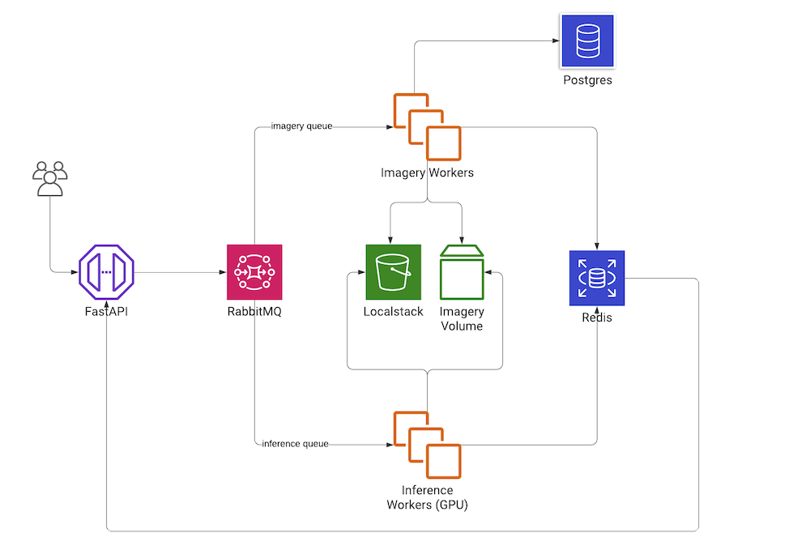
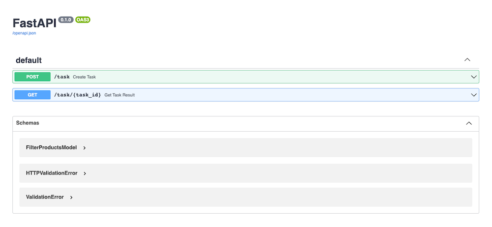

Fashion project
====================
A PoC project for fashion industry - made to be extensible and stable.

## Installation
Please, prepare the data: [Fashion Dataset](https://www.kaggle.com/paramaggarwal/fashion-product-images-small). Download the archive and extract it to `DATASET_PATH` from Makefile (or specify your own path).
```sh
make build
# make test - !tests are not implemented for now
```
## Run
```sh
make up
```
## Finish
```sh
make down
```
After running the command, there will be printed url to Jupyter notebook mapped to your localhost port (with a secret token). Also, you can run `docker-compose logs client` to find it out.
## Architecture

## Components
### API
[FastAPI](https://fastapi.tiangolo.com/) framework was chosen due to its performance and intuitiveness.
It provides a bunch of useful bultin features: asyncio support, data validation and documentation generation:


Also, according to [Benchmarks](https://www.techempower.com/benchmarks/#section=test&runid=7464e520-0dc2-473d-bd34-dbdfd7e85911&hw=ph&test=query&l=zijzen-7)
its SOTA web framework for Python ecosystem.

The main responsibilities of the component: 
- user authentication
- data validation 
- tasks registration
- status checking.

After validation of the request it sends task to `imagery` workers. And in case of `apply_model=True` it also chains `inference` after the original task. 

> In terms of performance, we can consider to use LoadBalancer for this part of the application if we encounter a huge requests load.
### Database
[PostgresSQL](https://www.postgresql.org/) was selected to be used as a metadata storage.
Initialization scripts and data are injected to the building process within `docker-entrypoint-initdb.d`
[Init script](src/database/sql/init.sql) describes a simple table. Of course, structure is dramatically simple, we definitely need to normalize the database.
As examples, I added several indexes and Enum type for the restricted data type.
>As for the real application, I would suggest use Django as Content Management service, where we can utilize ORM and migrations.
### Imagery volume
As a storage for the imagery data I decided to use local filesystem volume - such an equivalent of AWS Persistent Volume instance.
> As for the real application, I would suggest to use a CDN to deliver imagery data - e.g. nginx
 
### Celery message broker and backend
[RabbitMQ](https://www.rabbitmq.com/) is lightweight and easy to deploy. This service delivers messages to clusters of workers.
[Redis](https://redis.io/) is used as a storage for tasks results.

Both of these services are implemented as docker containers.
### Celery workers
Celery workers are docker containers, that can be easily extended in case of high workload. We can register more instances in `docker-compose.yaml` for any worker type.
#### Imagery
Imagery type of worker gets the task from the message broker, performes a request to the database and upload imagery data to the S3.
As for augmentation option, we need to pass `apply_augmentation` option to the request - after uploading original data, the process
will transform and upload images to a separate folder. Each task creates a folder on S3, and uploads the data with the following structure:
- images (original imagery data)
- metadata.json (features of the products)
- augmentation (transformed imagery)
> Uploading of the images was implemented by [ThreadPool](src/workers/imagery/app/uploader.py) because of I/O nature of this work.
> And augmentation process is performed by [Multiprocessing Pool](src/workers/imagery/app/augmentation.py) due to CPU-bound nature of the task. 
>Transformed images are uploaded to s3 from the main process
### Inference worker
For the inference, I used `pytorch` docker image, with custom Dataset and DataLoader with several workers.
Of course, the appropriate instance type for this task - GPU-enabled environment. We can specify all necessary parameters as environment variables: 
- num workers 
- inference device 
- batch size
> It is necessary to add, that this type of task cannot be started without running `imagery` task - that is why the method expects task guid as an input.
## Points to be added
### Testing
I added `test` command to `Makefile` but I haven't added any unit tests to the project - I had a lack of time. 
Of course, in real application we need to add tests for the main parts of the application:
- unit tests (api, workers, filtering logic, ML models)
- integration test
- benchmark tests
### Performance tracking
The system is definitely requires monitoring service, to track the status of the application. 
I would suggest to add Prometheus/Grafana services for such type of analytics. The main points to be tracked:
- number of failed workers
- incoming request workload
- max/min/avg wait time
- and e.t.c